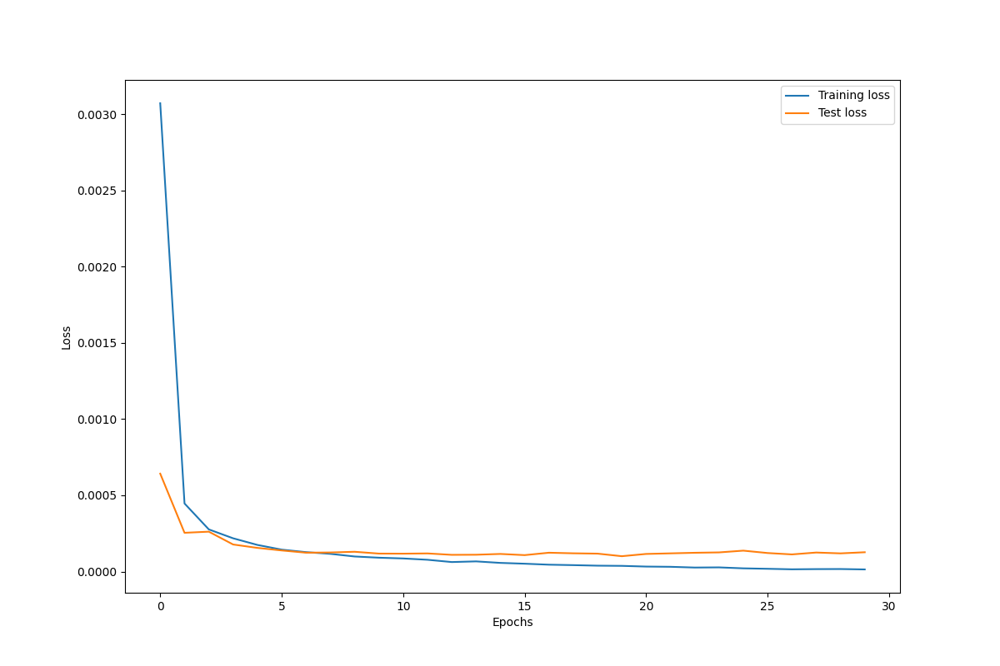
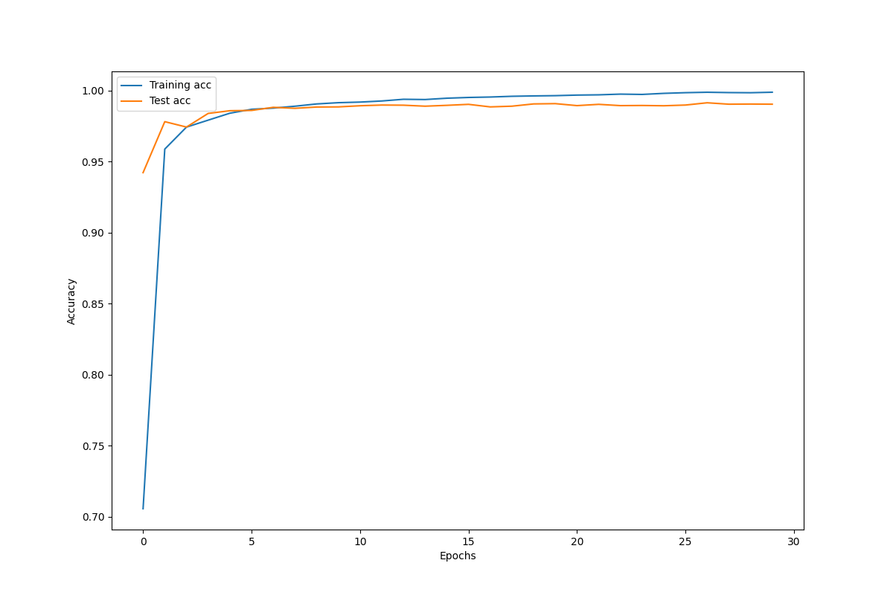
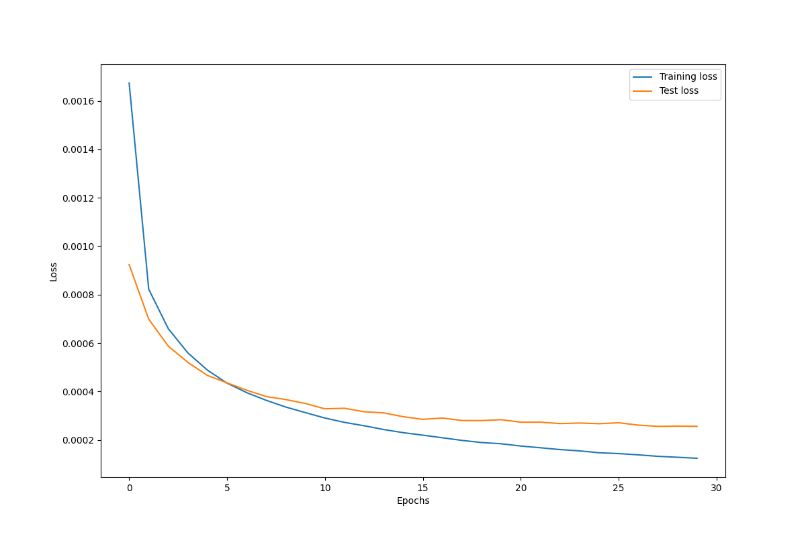
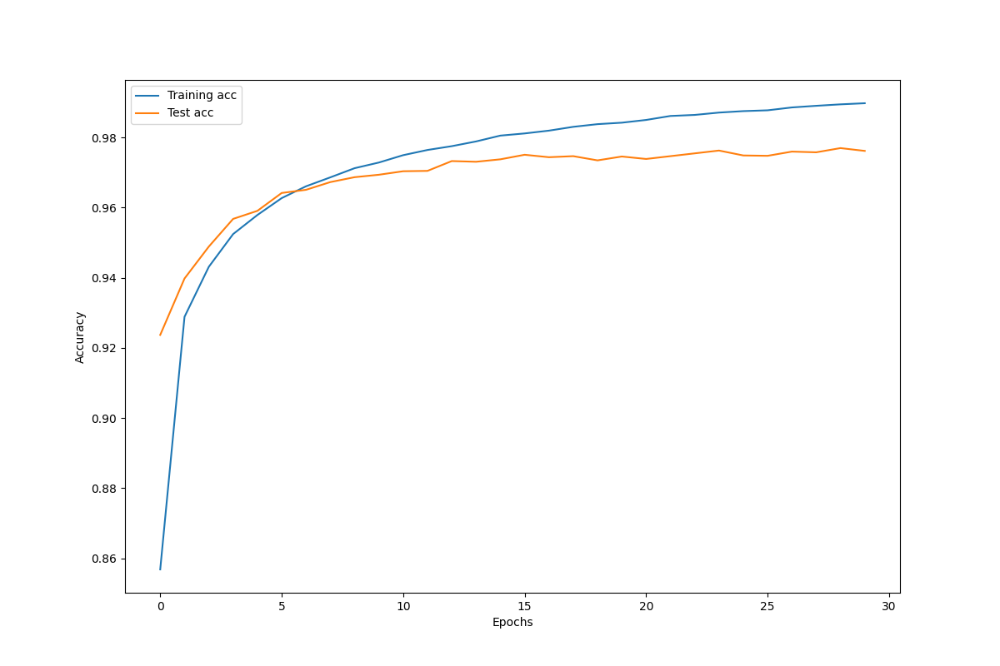
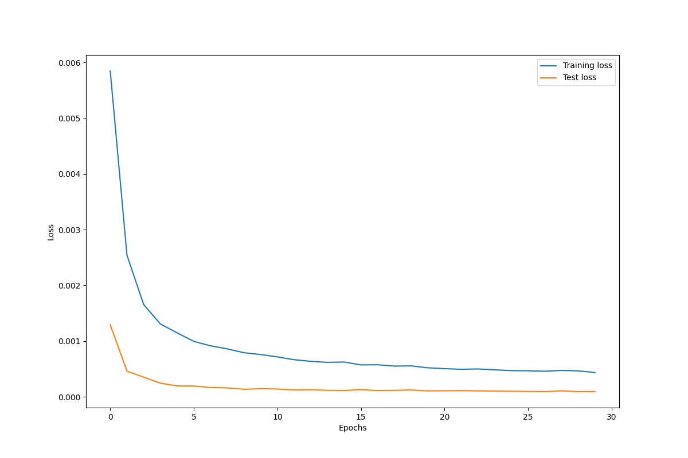

## MNIST Classification
In this assignment, you build a neural network classifier with MNIST dataset. For a detailed description about MNIST dataset, please refer to this [link](http://yann.lecun.com/exdb/mnist/).
* Due date: 2024. 04. 16. Tue 23:59
* Submission: Personal Github repo URL
  * `dataset.py`, `model.py`, `main.py`, `README.md` (Report) files
* Requirements
1. You should write your own pipeline to provide data to your model. Write your code in the template `dataset.py`. Please read the comments carefully and follow those instructions.
2. (Report) Implement LeNet-5 and your custom MLP models in `model.py`. Some instructions are given in the file as comments. Note that your custom MLP model should have about the same number of model parameters with LeNet-5. Describe the number of model parameters of LeNet-5 and your custom MLP and how to compute them in your report.
3. Write `main.py` to train your models, LeNet-5 and custom MLP. Here, you should monitor the training process. To do so, you need some statistics such as average loss values and accuracy at the end of each epoch.
4. (Report) Plot above statistics, average loss value and accuracy, for training and testing. It is fine to use the test dataset as a validation dataset. Therefore, you will have four plots for each model: loss and accuracy curves for training and test datasets, respectively.
5. (Report) Compare the predictive performances of LeNet-5 and your custom MLP. Also, make sure that the accuracy of LeNet-5 (your implementation) is similar to the known accuracy.
6. (Report) Employ at least more than two regularization techniques to improve LeNet-5 model. You can use whatever techniques if you think they may be helpful to improve the performance. Verify that they actually help improve the performance. Keep in mind that when you employ the data augmentation technique, it should be applied only to training data. So, the modification of provided `MNIST` class in `dataset.py` may be needed.
* **Note that the details of training configuration which are not mentioned in this document and the comments can be defined yourself.** For example, decide how many epochs you will train the model. 

## Report
1. (Report) Note that your custom MLP model should have about the same number of model parameters with LeNet-5. Describe the number of model parameters of LeNet-5 and your custom MLP and how to compute them in your report.
* Number of model parameters of LeNet-5 : **61706**
* Conv2d-1:`5*5*6+6=156`, Conv2d-2:`6*5*5*16+16=2416`, Linear-1:`400*120+120=48120`, Linear-2:`120*84+84=10164`, Linear-3:`84*10+10=850`
* Number of model parameters of CustomMLP : **62110**
* Dense-1:`1024*60+60=61500`, Dense-2:`60*10+10=610`

2. (Report) Plot above statistics, average loss value and accuracy, for training and testing. It is fine to use the test dataset as a validation dataset. Therefore, you will have four plots for each model: loss and accuracy curves for training and test datasets, respectively.
* LeNet-5 (Without dropout and data augmentation)

  
  

* Custom MLP

  
  

3. (Report) Compare the predictive performances of LeNet-5 and your custom MLP. Also, make sure that the accuracy of LeNet-5 (your implementation) is similar to the known accuracy.
* LeNet-5 exhibited an accuracy of **0.9922** on the test dataset, whereas custom MLP exhibited **0.9738**. LeNet-5 outperformed the custom MLP avoiding overfitting problem.

4. (Report) Employ at least more than two regularization techniques to improve LeNet-5 model. You can use whatever techniques if you think they may be helpful to improve the performance. Verify that they actually help improve the performance.
* LeNet-5 (With dropout and data augmentation)

  
  

* I employed dropout and RandomAffine augmentation as a regularization technique. LeNet-5 with regularization exhibited <b>0.9929</b> test data accuracy and outperformed previous LeNet-5 model. So we can see that the regularization technique was helpful to the model performance.
