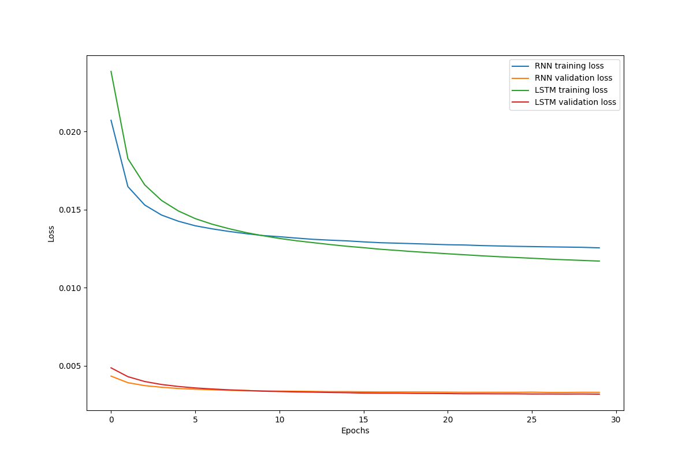

## Language Modeling
In this assignment, you will work on a neural network for character-level language modeling. Basically, you will experiment with the Shakespeare dataset. The language model you will build is a sort of "many-to-many" recurrent neural networks. Please see "Character-Level Language Models" section in [Karphthy's article](https://karpathy.github.io/2015/05/21/rnn-effectiveness/) for the detailed description.
* Due date: 2024. 05. 26. Sun 23:59
* Submission: Personal Github repo URL
  * `dataset.py`, `model.py`, `main.py`, `README.md` (Report) files
* Requirements
1. You should write your own pipeline to provide data to your model. Write your code in the template `dataset.py`.
2. Implement vanilla RNN and LSTM models in `model.py`. Some instructions are given in the file as comments. Stack some layers as you want if it helps the improvement of model's performance.
3. Write `main.py` to train your models. Here, you should monitor the training process using average loss values of both training and validation datasets.
4. (Report) Plot the average loss values for training and validation. Compare the language generation performances of vanilla RNN and LSTM in terms of loss values for validation dataset. 
5. Write `generate.py` to generate characters with your trained model. Choose the model showing the best validation performance. You should provide at least 100 length of 5 different samples generated from different seed characters. 
6. (Report) Softmax function with a temperature parameter T can be written as:
```math
y_{i} = \frac{\text{exp}(z_{i}/T)}{\sum\text{exp}(z_{i}/T)}
```
&nbsp;&nbsp;&nbsp;&nbsp;Try different temperatures when you generate characters, and discuss what difference the temperature makes and why it helps to generate
&nbsp;&nbsp;&nbsp;&nbsp;more plausible results.
* **Note that the details of training configuration which are not mentioned in this document and the comments can be defined yourself.** For example, decide how many epochs you will train the model.

## Report
1. (Report) Plot the average loss values for training and validation. Compare the language generation performances of vanilla RNN and LSTM in terms of loss values for validation dataset.
<div align="center">
  
</div>

* Although LSTM achieved lower loss than RNN on the training dataset, both LSTM and RNN converged to similar loss values on the validation dataset.

2. (Report) Try different temperatures when you generate characters, and discuss what difference the temperature makes and why it helps to generate more plausible results.
* Seed characters = 'The', 'I', 'Me', 'You', 'That'
